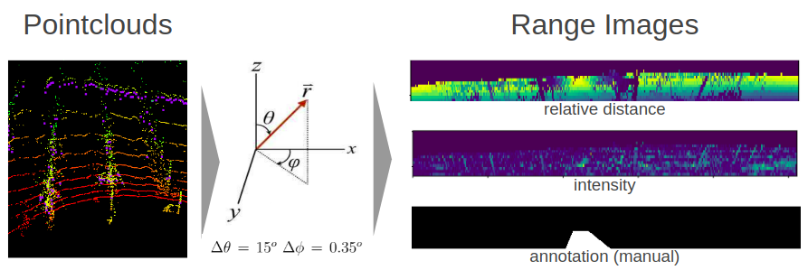
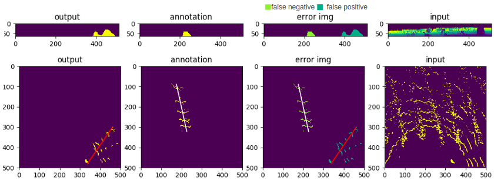

## Row Detection for Agriculture Robot using RIU-Net
This repo contains python codes that detects traversible row for agriculture robots  
using [UNet](https://arxiv.org/abs/1505.04597). This work largely follows the paper  
[RIU-Net: Embarrassingly simple semantic segmenta-tion of 3D LiDAR point cloud](https://arxiv.org/abs/1905.08748)  
Note that the very same pipeline could be used for generic object detection, while this  
repo only concerns about detecting a single row without row switching.

The purpose of this work is to enable autonomous, visual-based in-row navigation for  
agriculture robots. Specifcially, to address the occassions where GPS are not reliable  
 or not accurate enough. The training data were collected from a vineyard field using  
Velodyne's VLP-16, which was mounted on a mobile agriculture robot. The dataset is not  
shared in this repo because the author does not own them.  

## Run with Visualization
  
  * single model  
  
         python3 inference.py --m ./weight/unet.pth --show "all"
    
  * multiple model
  
         python3 inference.py --m ./weight/*.pth --show "all"

## Input of Unet
This work was implemented with 150 training images (augmented to 1050). The model takes  
2-channel inputs of range images (64x512):   
* relative distance of a point to the center of LIDAR  
* intensity capture by LIDAR
Note that in this work a limited horizontal filed of   
view [-180, 180] is considered.

## Example output
first row : output from network  
second row: deprojection into topview (sensor frame)

## Tricks to Improve Performance
* The data captured by VLP-16 originally corresponds to 16x512 image, which is too small  
for convulution layers. Thus each beam was repeated 4 times without extrapolation to  
make the image 64x512. 
* Futhermore, since the image has a larger width then width, the maxpool kernel is adjusted  
to (2,4) after first layer.
* To improve prediction and get a clear-cut boundary, weighted mask similiar to that of oringal  
UNet paper was developed and adopted to penalize loss more on pixels near boundaries.

   

## Limitations
The network was mostly trained on collected data which mostly face forward, with vehicle  
lying in the center. The behavior when the vehicle has different orientation is unclear.  
It is observed, though, at entrance and exit of a row, the model does deterioate in terms  
of performance. Such limitation may be able to be overcomed with more training data.
  
