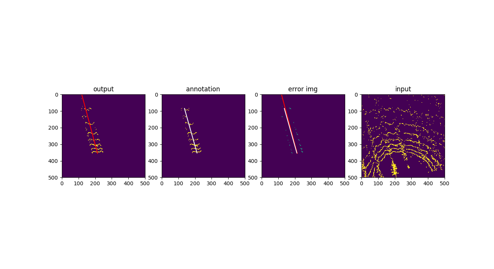

## Row Detection for Agriculture Robot using RIU-Net
This repo contains python codes that detects traversible row for agriculture robots  
using [UNet](https://arxiv.org/abs/1505.04597). This work largely follows the paper  
[RIU-Net: Embarrassingly simple semantic segmenta-tion of 3D LiDAR point cloud](https://arxiv.org/abs/1905.08748)  
Note that the very same pipeline could be used for generic object detection, while this  
repo only concerns about detecting a single row without row switching.

The purpose of this work is to enable autonomous, visual-based in-row navigation for  
agriculture robots. Specifcially, to address the occassions where GPS are not reliable  
 or not accurate enough. The training data were collected from a vineyard field using  
Velodyne's VLP-16, which was mounted on a mobile agriculture robot. The dataset is not  
shared in this repo because the author does not own them.

  click image for demo video  

## Input of Unet
This work was implemented with 150 training images (augmented to 1050). The model takes  
2-channel inputs of range images:   

* relative distance of a point to the center of LIDAR  

* intensity capture by LIDAR

Note that in this work a limited horizontal filed of view [-180, 180] is considered.

## Example output
first row: output from network | second row: deprojection into topview(sensor frame)

## Run with Visualization
  
  *single model
  
    python3 inference.py --m ./weight/unet.pth --show "all"
    
  *multiple model
  
    python3 inference.py --m ./weight/*.pth --show "all"
